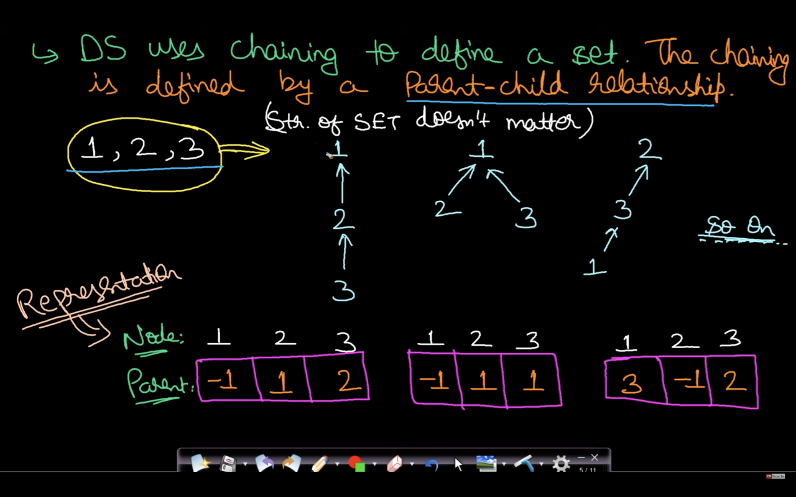
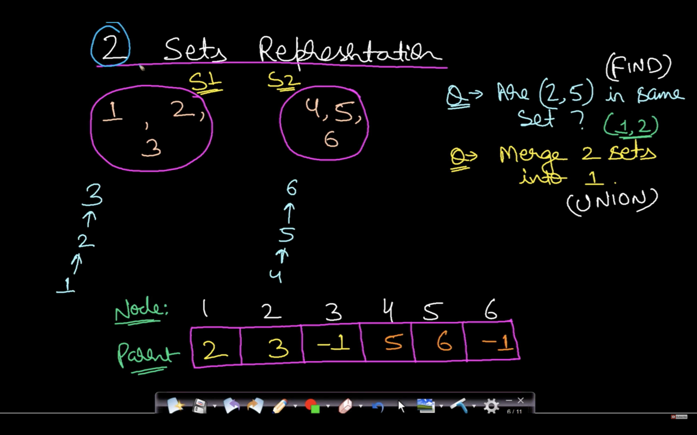
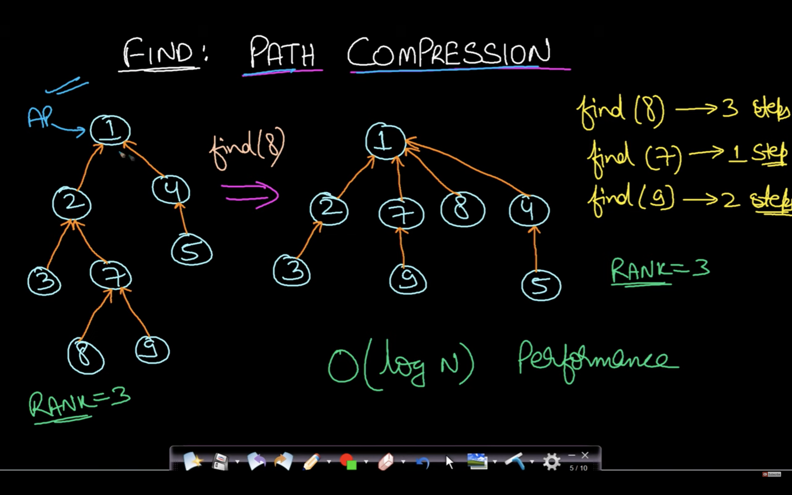
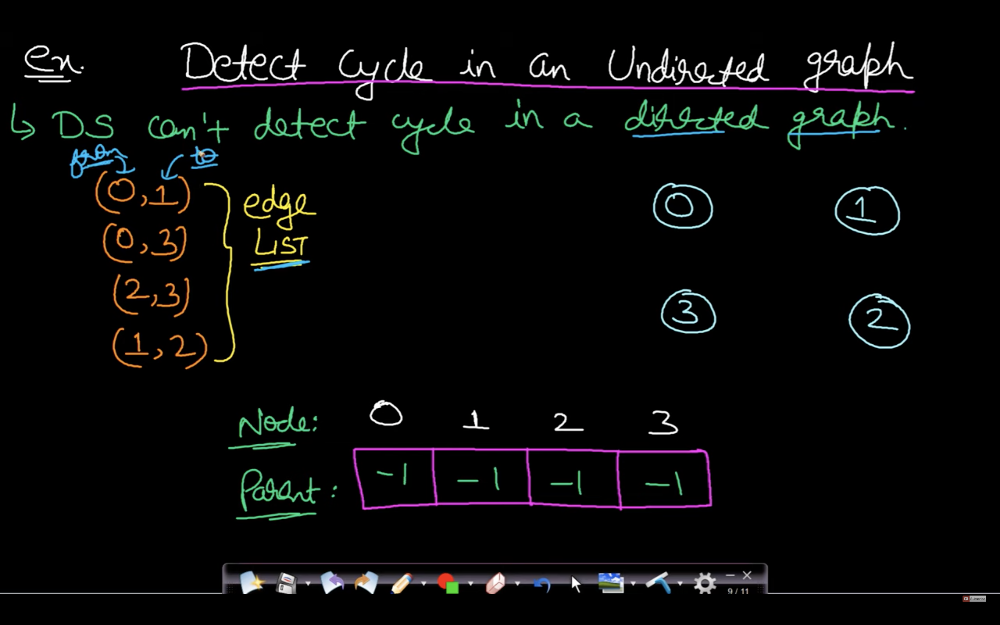
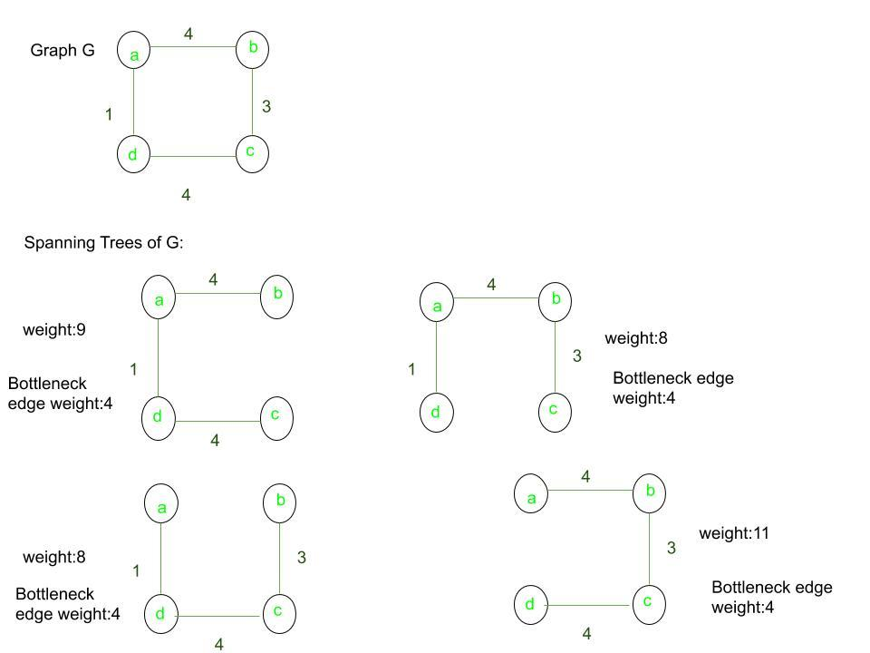

Graph:
------
    It is a data structure which is represented as a finite set of nodes (Vertex) & edges.

-------------
Applications:
-------------
    1. Shorted paths in Google Maps.
        Vertex  ->  Cities / Landmark
        Edge    ->  Roads / Flights
    2. Social Networking (FB, LinkedIn, Instagram, etc....)
        Vertex  ->  People
        Edge    -> connections
    3. Cicuit Design (Minimum length of the wire that supplies current to all the nodes & complete the circuits.)
        Vertex  ->  Resistors
        Edge    ->  Wire
    4. Routing algorithms
        Vertex  ->  routers across the globe
        Edge    ->  Time taken for packets to flow.
    5. Resolving dependencies.
        Vertex  ->  Api calls / software installations
        Edge    ->  Dependencies b/w tasks
    6. Deep learning
        Vertes  ->  Neurons
        Edge    ->  Connections b/w them.
    7. Web Document
        Vertex  ->  Dom elements
        Edge    ->  Connections

--------------------
Graph representation
--------------------
    1. Adjacency Matrix     --> Recommended to use for Dense Graph.
    2. Adjacency Lists (AdjacencyList.cpp)    --> Recommended to use for Sparse Graph.

    *Pros of Adjacency Matrix*
        - Easy to implement.
        - Removing an edge will take O(1) time.
        - Queries like whether there is an edge from vertex `u` to vertex `v` can be done in O(1).
    
    *Cons of Adjacency Matrxi*
        - It will consume `O(n*n)` space, where `n` is the number of vertex in the graph.
        - Addition of a new vertex will take `O(n)` time.
            For addition of a new vertex we need to increase both the row & column of the existing adjacency matrix,
            and then intialize the new elements related to that vertex to 0.
        - Removing of an vertex will take `O(n*n)` time.
            To remove a vertex we need to check if that vertex exists or not, then
            we need to shift the rows to the left & columns to upward.
            

    *Pros of Adjacency Lists*
        - Saves space O(m+n) : n is number of vertex & m is number of edges.
            Worst case space is O(n*n)
        - Adding a vertex is easier.

    *Cons of Adjacency Lists*
        - Query like whether there is an edge from vertex u to vertex v or not is O(n).

---------------
Graph Traversal
---------------
                    BFS (Breadth first search)                               DFS (Depth first search)
            
            - Iterative way                                         - Recursive way.
            - Uses Queue.                                           - Uses stack.

                
---------------
Graph Traversal     `BFS`
---------------
    - It traverses graph 'Breadth first', starting from source, then direct neighbours of source vertex,
        & then next layer and so on.....

    - Finding Shorted path of unweighted graph.

    - Snake & Ladder problem.

---------------
Graph Traversal     `DFS`
---------------

------------
Disjoint set    `DisjointSet.cpp`
------------
    - Two or more sets with nothing in common.
        Eg. 
            set = [1, 2, 3, 4, 5]
            set1 = [1, 2, 3]
            set2 = [4, 5]

            set is divided into 2 sets set1 & set2.
            intersection(set1, set2) = NULL     --> set1 & set2 are disjoint set.
    
    *Uses of disjoint set*
        - It keeps track of the set that an elements belongs to,
            It is easier to check, given two elements whether they belongs to the same set or not.
        
        - Used to set 2 sets into one set.
    
    *Disjoint set uses chaining to define a set*
        - The chaining is defined by parent-child relationship.

    *Representing multiple sets using an array*
        - In the below example, it represents 2 sets in an array.

    *Find operation*
        - We need to find the absolute root (AR) of both the node, & finally compare them.
            If same --> both belongs to the same set.
            else    --> both belongs to different set.
        
        In the above example:
            AR(1) = 3       AR(4) = 6
            AR(2) = 3       AR(5) = 6
            AR(3) = 3       AR(6) = 6

        - Time :: O(n)

        **Optimization**    Path Compression
        
            - Time :: O(log(n))

            - while finding the absolute root of any node recursively update the absolute node in the array,
                such that need not traverse recursively for the next time.
                Also this way we are going to update the absolute node of the other node which is coming on the way.

            Eg.

        

    *Union of two sets*
        - For finding the union of two set just point absolute root of one set to the absolute root of the other set.
            Eg.
                In the above example AR(1) = 3, & AR(4) = 6,
                if we want to find union of both the set then just point AR(1) i.e 3 to 6 or AR(4) i.e 6 to 1.

        - Time :: O(n)

        **Optimization**    Union by Rank
            - Time  :: O(log(n))
            - Joing the absolute root based on the rank of the absolute root node.
                if rank(AR(u)) > rank(AR(v))    --> Point AR(v) to AR(u)
                if rank(AR(u)) < rank(AR(v))    --> Point AR(u) to AR(v)
                if rank(AR(u)) = rank(AR(v))    --> Point any one to another & increase the rank by one for the node which is the final absolute root.

            - For this operation we need to have the rank & parent of every node.
                struct Node
                {
                    int parent;
                    int rank;
                }

    *Detect cycle in undirected graph using disjoint set.*
        - Disjoint set can't be used to detect cycle in the directed graph, b/c union operation does not have any direction meaning
            u->v & v->u both are same as per the set perspective.

        1. Initially all the nodes will be disjoint (AR of each node is itself).
        2. process edge uv and find if u & v both are in same or not.
            if set(u) != set(v)     -> Take union of them.
            else                    -> it means there is already a path from u to v, & if we have this edge uv then it will for sure create a cycle in the graph.
        3. repeat this for all the edges.

        * Time compexity = O(n * m)
            m = processing all the edges.
            n = for find or union operation

-------------
Spanning Tree
-------------
    - A spanning tree is the subset of Graph G, which has all the vertices covered with minimum number of edges.
        vertex_set of spanniing tree  = vertex_set of the Graph
        Edge_set of spanning tree is the subset of Edge_set of the Graph.
    
    - Eg.

    - Spanning tree can only be found for the connected Graph.
    - If the number of vertices in the Graph is v
        then number of edges in spanning tree will be v-1
    - A complete undirected graph has n^(n-2) number of different spanning tree possible.
    - A connected & undirected graph has atleast one spanning tree.
    - ST is minimally connected i.e removing one edge will disconnect the graph.
    - ST is maximally acyclic i.e if we add even one edge then graph will become cyclic.

------------------------------------------------
How to find number of spanning tree in the graph
------------------------------------------------
    1. If graph is complete graph with n vertices (or) number of labelled trees (not binary trees) with n veritces.?

        ==> Use Cayley's formula

        n^(n-2)

    2. If the Graph is not complete, use Kirchhoff's theorem

        a. Create Adjacency matrix for the given graph.
        b. Replace the diagonal elements with the degree of the corresponding node.
        c. Replace all non-diagonal 1's with -1.
        d. Calculate co-factor of any element >> This cofactor will give the number of spanning tree for that graph.

---------------------
Minimum spanning tree
---------------------
    - Spanning tree with the minimum cost in a weighted graph.
    - There can be several MST with the same weight.

    *Application*
        - Network design of telephone, electrical, internet....
        - Approximation algo for NP hard problems :  eg. Travelling salesman problem, steiner tree.

-------------
MST Algorithm
-------------
    1. Kruskal  (Greedily picks edges with minimum weight.)
        - Time : O(m*log(n))
        - uses disjoint set approach.
    2. Prim's   (Greedily picks Vertices with minimum distance from the source node.)
        - Time : O(m*log(n))
        - uses min heap approach.

    -------------
    Kruska's algo
    -------------
        1. Sort all the edges in non-decreasing order of there edge weight.
        2. Create a disjoint set for all the vertices.
        3. Creat a empty set (result_set) to track all the edges in the spanning tree.
        4. Pick edge u-v one by one in sorted order by there edge weight.
            a. if set(u) != set(v)      --> this means by adding this edge there won't be any cycle in the spanning tree.
                ==> Add this edge into the result_set.
                ==> join the set u and v.
            b. if set(u) == set(v)      --> this means by adding this edge it will form a cycle.
                ==> Do nothing.

    -----------
    Prim's algo
    -----------

------------------------
Snakes N Ladders Problem
------------------------

    - This problem can be thought as a `Unweighted Directed Graph` problem, where from each cell we go to another cell.
    - Eg. 
        From 1  -> 2
        From 2  -> 15
        
    - Unweighted b/c we need one dice throw to move from one node to another.
    - We need to handle `snakes` & `ladders`,
        like if we reach at cell 2, it will take me to cell 15.
        similarly, if we reach at cell 34, it will take me to cell 12.
        * For handlig this we can create a mapping like below
            2   ->  +13
            5   ->  +2
            9   ->  +18
            17  ->  -13            
            18  ->  +11
            20  ->  -14
            24  ->  -8            
            25  ->  +10
            32  ->  -2
            34  ->  -22

        

    